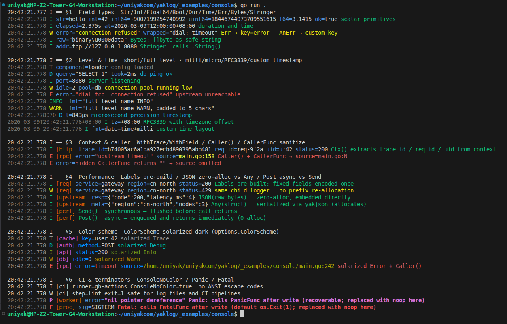

# yaklog

**English** | [中文](README.zh.md)

[](https://github.com/uniyakcom/yaklog/actions/workflows/test.yml)
[](LICENSE)
[](https://go.dev/)
[](https://goreportcard.com/report/github.com/uniyakcom/yaklog)

yaklog is a high-performance structured logging library for the yak\* ecosystem.

- **Zero-allocation hot path**: Uses `bufpool` pre-allocated buffers + `sync.Pool`; heap allocations on the normal log path are zero.
- **Sync / Async dual paths**: `Send()` writes synchronously in the caller's goroutine; `Post()` dispatches to a package-level worker for asynchronous batched writes.
- **Fluent API**: Two-level fluent chain (`Logger` + `Event`), no reflection, type-safe.
- **JSON / Text dual format**: Automatically switches to human-readable text when the target is `Console`; all other targets default to JSON.
- **Pluggable samplers**: `RateSampler` (token bucket) / `HashSampler` (deterministic hash sampling).
- **`adapter` sub-package**: Adapts `*Logger` to `slog.Handler`, taking over `slog.Default()` and `stdlib log`.
- **Hot-path safe**: The library never uses `panic` for error handling internally; write failures are only counted.

---

## Installation

```bash
go get github.com/uniyakcom/yaklog
```

> **Requirements**: Go 1.25+. No third-party external dependencies (only depends on same-ecosystem `yakutil` / `yakjson`).

---

## Quick Start

```go
import "github.com/uniyakcom/yaklog"

func main() {
    // Create a Logger with default config (output to os.Stderr, level Info, JSON format)
    l := yaklog.New()
    l.Info().Str("app", "demo").Msg("service starting").Send()

    // Custom Logger
    logger := yaklog.New(yaklog.Options{
        Level: yaklog.Debug,
        Out:   yaklog.Console(),   // Text format to os.Stderr
    })
    logger.Debug().Str("env", "dev").Send()

    // Wait for all async log writes before process exit
    yaklog.Wait()
}
```

---

## Global Configuration

`yaklog.Config` sets package-level defaults and (lazily) initializes the global worker goroutine:

```go
yaklog.Config(yaklog.Options{
    Level:          yaklog.Info,
    Out:            yaklog.Save("./logs/app.log"),
    FileMaxSize:    128,         // MB, rotate after exceeding
    FileMaxAge:     7,           // days
    FileMaxBackups: 5,
    FileCompress:   true,
    QueueLen:       8192,
    FlushInterval:  50 * time.Millisecond,
})
```

`Config` may be called multiple times, but `QueueLen` and `FlushInterval` only take effect on the **first call** (or the first `New()` call) — the internal worker is started exactly once via `sync.Once`. All other fields (`Level`, `Out`, `Source`, etc.) apply on every call and affect all subsequent zero-argument `New()` calls. Call it once at the very beginning of `main` for a clean initialization.

---

## Options Fields

| Field | Type | Default | Description |
|-------|------|---------|-------------|
| `Level` | `Level` | `Info` | Minimum output level |
| `Out` | `io.Writer` | `os.Stderr` | Output target (`Console()` / `Save(...)` / `Discard()` / any `io.Writer`) |
| `Source` | `bool` | `false` | Whether to append file name and line number to each log entry |
| `CallerFunc` | `func(file string, line int) string` | `nil` | Custom formatter for the `source` field; receives the raw file path and line number, returns the string written to the log. Return `""` to suppress the field entirely. Useful for filename-only (`path.Base(file)`), path sanitization, or relative-path trimming. Ignored when `Source` is `false`. |
| `TimeFormat` | `TimeFormat` | `TimeRFC3339Milli` | Time format (see section below) |
| `Sampler` | `Sampler` | `nil` (all) | Pluggable sampler |
| `QueueLen` | `int` | `4096` | Async queue depth (only used by `Post()`) |
| `FlushInterval` | `time.Duration` | `100ms` | Worker periodic flush interval |
| `FilePath` | `string` | `""` | Log file path; if `Out` is nil, automatically calls `Save(FilePath)`. Accepts absolute or relative paths — relative paths are resolved to absolute at configuration time using the process working directory, so they will not drift even if `os.Chdir` is called later. Empty string falls back to `os.Stderr`. |
| `FileMaxSize` | `int` | `100` (MB) | Maximum single-file size in MB |
| `FileMaxAge` | `int` | `0` (no limit) | Backup file retention in days; 0 = never expire |
| `FileMaxBackups` | `int` | `0` (no limit) | Maximum number of old files to keep; 0 = unlimited |
| `FileCompress` | `bool` | `false` | Whether to gzip-compress rotated archives |
| `FileLocalTime` | `bool` | `false` | Use local time in rotated file names (otherwise UTC) |
| `ConsoleTimeFormat` | `string` | `"15:04:05.000"` | Time string for Console text format (`time.Format` layout) |
| `ConsoleNoColor` | `bool` | `false` | `true` = disable ANSI color output |
| `ConsoleLevelFull` | `bool` | `false` | `true` = full level name (`INFO`/`WARN`…); default single letter (`I`/`W`…) |
| `ColorScheme` | `ColorScheme` | zero value | Custom ANSI color scheme; zero-value fields use built-in defaults; ignored when `ConsoleNoColor: true` |

> **Console visual scheme**
>
> | Element | Color | Notes |
> |---------|-------|-------|
> | Timestamp | dim gray (`\x1b[2m`) | Low visual weight; recedes to background |
> | Level letter / name | Per-level color (see table above) | Highest visual priority |
> | Tag `[name]` | Orange-256 (`\x1b[38;5;166m`) | Immediately after level; set via `logger.Tag("name")`; omitted when not set |
> | Field `key=` | Dark blue (`\x1b[34m`) | Includes `=`; muted, never conflicts with level colors |
> | Field value | Default (white) | Stands out against the dim key |
> | `Err()` value | Inherits current level color | Red for Error, yellow for Warn, etc. |
>
> **Spacing rules**: single-letter level → 1 space before first field; full-level names are padded to 5 chars (e.g. `INFO `) for column alignment, then 1 space; 1 space between every field; 1 space before message.
> Disable all color with `ConsoleNoColor: true`.



---

## ColorScheme

Per-logger ANSI color customization. Pass a `ColorScheme` value in `Options.ColorScheme`; any zero-value field falls back to the built-in default.

```go
type ColorScheme struct {
    Trace  string // default: "\x1b[90m"  (dark gray)
    Debug  string // default: "\x1b[36m"  (cyan)
    Info   string // default: "\x1b[32m"  (green)
    Warn   string // default: "\x1b[33m"  (yellow)
    Error  string // default: "\x1b[31m"  (red)
    Panic  string // default: "\x1b[1;35m" (bold magenta)
    Fatal  string // default: "\x1b[1;31m" (bold red)
    Time   string // default: "\x1b[2m"   (dim)
    Key    string // default: "\x1b[34m"  (blue)
    Tag    string // default: "\x1b[38;5;166m"  (orange, 256-color)
    Source string // default: "\x1b[93m"  (bright yellow)
}
```

**Solarized-dark palette example:**

```go
logger := yaklog.New(yaklog.Options{
    Out:   yaklog.Console(os.Stdout),
    Level: yaklog.Trace,
    ColorScheme: yaklog.ColorScheme{
        Trace:  "\x1b[38;5;244m",
        Debug:  "\x1b[38;5;37m",
        Info:   "\x1b[38;5;64m",
        Warn:   "\x1b[38;5;136m",
        Error:  "\x1b[38;5;160m",
        Panic:  "\x1b[38;5;125m",
        Fatal:  "\x1b[1;38;5;160m",
        Time:   "\x1b[38;5;240m",
        Key:    "\x1b[38;5;33m",
        Tag:    "\x1b[38;5;166m",
        Source: "\x1b[38;5;142m",
    },
})
```

> `ColorScheme` has no effect when `ConsoleNoColor: true` or when using JSON output (`Save`/`File*`).

---

## Time Formats

```go
const (
    TimeRFC3339Milli TimeFormat = iota // "2006-01-02T15:04:05.000Z07:00" (default)
    TimeUnixSec                        // Unix second integer
    TimeUnixMilli                      // Unix millisecond integer
    TimeUnixNano                       // Unix nanosecond integer
    TimeOff                            // Omit time field
)
```

---

## Log Levels

```go
const (
    Trace Level = -2  // Lowest trace level
    Debug Level = -1
    Info  Level =  0  // Zero value, default minimum output level
    Warn  Level =  1
    Error Level =  2
    Panic Level =  3  // Writes log then calls PanicFunc (default: built-in panic); can be caught by defer/recover
    Fatal Level =  4  // Writes log + drains queue, then calls FatalFunc (default: os.Exit(1))
)
```

| Level | Value | Behavior |
|-------|-------|----------|
| `Trace` | −2 | Normal output |
| `Debug` | −1 | Normal output |
| `Info` | 0 | Normal output (default minimum level) |
| `Warn` | 1 | Normal output |
| `Error` | 2 | Normal output |
| `Panic` | 3 | Writes log synchronously then executes `PanicFunc` (default: built-in `panic`); recoverable via `defer/recover` |
| `Fatal` | 4 | Writes log synchronously + drains queue, then calls `FatalFunc` (default: `os.Exit(1)`) |

---

## FatalFunc and PanicFunc Hooks

yaklog abstracts the `Fatal` exit action and `Panic` action into replaceable functions, primarily for capturing these behaviors in tests.

### Hook Reference

| Hook | Default behavior | Setter |
|------|-----------------|--------|
| `FatalFunc` | `os.Exit(1)` | `yaklog.SetFatalFunc(fn)` |
| `PanicFunc` | `panic(msg)` | `yaklog.SetPanicFunc(fn)` |

### Scenario 1: Capture Fatal in tests (without actually exiting)

> Note: use `Send()` rather than `Post()` in tests. See the **Notes** section below for the reason.

```go
func TestFatalLogsAndExits(t *testing.T) {
    var exitCode int
    var exitCalled bool

    // Save and restore
    old := yaklog.GetFatalFunc()
    defer yaklog.SetFatalFunc(old)
    yaklog.SetFatalFunc(func(code int) {
        exitCode = code
        exitCalled = true
        // Do NOT call os.Exit: prevents the test process from exiting
    })

    var buf bytes.Buffer
    l := yaklog.New(yaklog.Options{Out: &buf, Level: yaklog.Info})
    l.Fatal().Str("reason", "disk full").Msg("service crashed").Send()

    if !exitCalled {
        t.Fatal("expected Fatal to invoke FatalFunc")
    }
    if exitCode != 1 {
        t.Errorf("expected exit code 1, got %d", exitCode)
    }
    m := decodeJSON(t, strings.TrimSpace(buf.String()))
    if m["level"] != "FATAL" || m["msg"] != "service crashed" {
        t.Errorf("unexpected log content: %v", m)
    }
}
```

### Scenario 2: Capture Panic in tests (without actually panicking)

```go
func TestPanicLogsAndPanics(t *testing.T) {
    var panicMsg string

    old := yaklog.GetPanicFunc()
    defer yaklog.SetPanicFunc(old)
    yaklog.SetPanicFunc(func(msg string) {
        panicMsg = msg
        // Do NOT call panic: silently captures the message in test path
    })

    var buf bytes.Buffer
    l := yaklog.New(yaklog.Options{Out: &buf, Level: yaklog.Info})
    l.Panic().Str("op", "write").Msg("nil pointer").Send()

    if panicMsg != "nil pointer" {
        t.Errorf("expected panic message 'nil pointer', got %q", panicMsg)
    }
    // Log must be written before PanicFunc is called
    if !strings.Contains(buf.String(), "PANIC") {
        t.Error("log not written")
    }
}
```

### Scenario 3: Custom exit cleanup in production

```go
func main() {
    // Prepare metrics client
    metrics := initMetrics()

    // Replace FatalFunc: flush metrics before exiting
    yaklog.SetFatalFunc(func(code int) {
        // On Fatal crash, flush metrics to monitoring platform first
        metrics.Flush()
        os.Exit(code)
    })

    // ... business logic ...
}
```

> **Notes**
>
> 1. **Queue drain for `Post()` + `Fatal` only happens when FatalFunc is `os.Exit`**: Once a custom FatalFunc is set, `Fatal.Post()` does not wait for the queue to drain. If you need all async logs flushed before a custom exit, call `yaklog.Wait()` first, then trigger Fatal.
> 2. **Prefer `Send()` for Fatal-level logs**: Guarantees the log content is written synchronously before `FatalFunc` is called.
> 3. **`PanicFunc` is expected not to return**: In production, a custom `PanicFunc` should call built-in `panic(msg)` or `runtime.Goexit()`; if it returns normally, execution continues past the log call rather than crashing.

---

## Output Targets

> **File safety checks** — When the target path already exists, `Save` / `FilePath` performs three checks before opening the file:
> 1. Must be a regular file (not a directory, device, socket, etc.); otherwise `ErrNotLogFile` is returned.
> 2. Must not have any executable permission bits (`mode & 0111`); otherwise `ErrNotLogFile` is returned.
> 3. The first 4 bytes must not match a known binary magic number (ELF `\x7fELF`, Mach-O, PE `MZ`); otherwise `ErrNotLogFile` is returned.
>
> These checks prevent accidentally pointing a log path at an executable or binary, which would silently corrupt it.

```go
// Text format, output to os.Stderr (no args = os.Stderr)
out := yaklog.Console()

// Text format, output to a custom io.Writer
out := yaklog.Console(myWriter)

// Multi-target output: combine with io.MultiWriter
out := yaklog.Console(io.MultiWriter(os.Stderr, myFile))

// File with rotation — accepts absolute or relative path.
// Relative paths are resolved to absolute at call time (process cwd).
out := yaklog.Save("./logs/app.log")

// Discard all output (testing / benchmarking scenarios)
out := yaklog.Discard()
```

---

## Logger Fluent Modifications

All modification methods return a new `*Logger`; the original Logger is unaffected.

### Label — Attach fixed fields

```go
reqLog := logger.Label("service", "api").Label("version", 2)
reqLog.Info().Msg("request received").Send()
// Output: {"level":"INFO","service":"api","version":2,"msg":"request received"}
```

`Label` accepts values of type `string / int / int64 / uint64 / float64 / bool / any`.

### Tag — Component label

```go
// Attach a component label; rendered as [name] after the level indicator in Console
cacheLog := logger.Tag("cache")
cacheLog.Info().Str("op", "lookup").Msg("cache hit").Send()
// Console: 10:30:00.123 I [cache] op=lookup cache hit
// JSON:    {"level":"INFO","tag":"cache","op":"lookup","msg":"cache hit"}
```

`Tag` returns a new `*Logger` (shares level and wait group with the parent). In Console mode the label is rendered in orange-256 (`\x1b[38;5;166m`) immediately after the level indicator; in JSON mode it emits `"tag":"name"` as the field directly after `level`. Calling `Tag` with an empty string removes the label.

### Fork — Independent level and wait group

```go
// Derive a child Logger with independent level control (does not affect parent's level)
auditLog := logger.Fork()
auditLog.SetLevel(yaklog.Warn)
```

### Context — Bind a context

```go
// All subsequent events automatically read trace_id from ctx
l := logger.Context(ctx)
```

### To — Switch output target

```go
// Same Logger logic, output redirected to another io.Writer
fileLog := logger.To(yaklog.Save("./debug.log"))
```

> `To(nil)` silently discards all writes and reports `ErrWriterClosed` via the `OnWriteError` callback.

### SetLevel / GetLevel

```go
logger.SetLevel(yaklog.Debug)
current := logger.GetLevel()
```

### Wait — Wait for Logger-level async writes

`logger.Wait()` waits only for that Logger (and `Label`-derived child Loggers sharing the same wait group) to finish all pending `Post()` tasks. Unlike `yaklog.Wait()` (package-level global wait), it does not affect other Logger instances.

```go
// Wait only for this Logger (and its Label children) Post() tasks
logger.Wait()
```

> If you created independent child Loggers via `Fork()`, you need to call `Wait()` on each of them separately.

---

## Event Builder Chain

Each log level method returns `*Event`; `Msg()` sets the message body and returns the same `*Event`; finally call `Send()` or `Post()` to terminate.

```go
l.Info().
    Str("method", "GET").
    Str("path", "/api/users").
    Int("status", 200).
    Dur("latency", 3*time.Millisecond).
    Msg("HTTP request completed").
    Send()
```

> **Important**: `Msg()` is NOT a terminator — you must follow it with `Send()` or `Post()` to trigger the write.

### Supported Field Methods

| Method | Output Example |
|--------|----------------|
| `Str(key, val string)` | `"key":"val"` |
| `Int(key string, val int)` | `"key":42` |
| `Int64(key string, val int64)` | `"key":-1` |
| `Uint64(key string, val uint64)` | `"key":18446...` |
| `Float64(key string, val float64)` | `"key":3.14` |
| `Bool(key string, val bool)` | `"key":true` |
| `Time(key string, val time.Time)` | `"key":"2026-01-02T..."` |
| `Dur(key string, val time.Duration)` | `"key":"3m7s"` |
| `Err(err error)` | `"error":"..."` (skipped if nil) |
| `AnErr(key string, err error)` | `"key":"..."` (skipped if nil) |
| `Bytes(key string, val []byte)` | `"key":"..."` (zero-copy) |
| `Any(key string, val any)` | `"key":<JSON>` (serialized via yakjson) |
| `JSON(key string, raw []byte)` | `"key":<raw>` (raw bytes embedded as-is; zero-alloc, no reflect) |
| `Stringer(key string, val fmt.Stringer)` | `"key":"..."` |
| `Ctx(ctx context.Context)` | Overrides the Logger-bound ctx (for trace_id extraction) |
| `Caller()` | Appends `source=file:line`; per-event alternative to global `Source: true` |
| `Msg(msg string)` | Sets message body, **returns \*Event**, not a terminator |

### Send vs Post

```go
// Send: writes synchronously in the caller's goroutine; data is flushed when it returns
e.Send()

// Post: enqueues into the global worker queue for async write; returns immediately
// If the queue is full, the entry is dropped (counted in Dropped()); never blocks
e.Post()
```

---

## Sync / Async Wait

### Why you must call Wait()

`Post()` enqueues log buffers into the package-level worker queue and **returns immediately**. If the process exits before the worker finishes writing, any entries still in the queue are **silently lost** with no warning.

**Consequences of exiting without calling `Wait()`** (`Post()` path):

- Remaining entries in the queue are permanently lost
- This includes critical-level logs such as `Error` and `Warn`
- Especially noticeable in load-testing or batch-processing scenarios

**Recommended pattern**:

```go
func main() {
    yaklog.Config(yaklog.Options{...})
    defer yaklog.Wait() // Ensure all Post logs are flushed before process exit

    // ... business logic ...
    l.Info().Msg("service started").Post()
}
```

```go
// Package-level Wait: waits for all async tasks submitted via Post() to finish writing
// Covers Post tasks from all Logger instances
yaklog.Wait()

// Logger-level Wait: waits only for this Logger instance (and Label children) Post() tasks
// Fork()-derived child Loggers have independent wait groups; wait on them separately
logger.Wait()

// Check total Post tasks dropped due to a full queue (for monitoring)
dropped := yaklog.Dropped()

// Check total write failure count (Send + Post paths, I/O error counter)
errs := yaklog.ErrCount()
```

> **Send() path does not need Wait()**: `Send()` completes the write synchronously in the caller's goroutine; data is flushed by the time it returns and never enters the queue.

> **Concurrent `Post()` during `Wait()`**: Any `Post()` call that races against `Wait()` is not guaranteed to be covered by that `Wait()` invocation. Ensure all producers have stopped submitting before calling `Wait()`; violating this is safe (no crash, no data corruption) but may leave some entries unflushed.

### Wait vs Shutdown

| | `Wait()` | `Shutdown()` |
|---|---|---|
| Drains queue | ✅ | ✅ |
| Accepts new `Post()` after call | ✅ | ❌ (returns `ErrWriterClosed`) |
| Suitable for | Mid-program checkpoints, logger-level sync | Process exit, final teardown |
| Reversible | ✅ | ❌ |

Typical pattern: use `defer yaklog.Wait()` during normal operation; call `yaklog.Shutdown()` only if you want to permanently stop the async writer (e.g. in a graceful-shutdown hook where no further logging is expected).

---

## Context Injection

### TraceID

```go
import "github.com/uniyakcom/yaklog"

// Inject a [16]byte TraceID into context
var traceID [16]byte
copy(traceID[:], someTraceBytes)
ctx = yaklog.WithTrace(ctx, traceID)

// Logger bound to ctx automatically appends "trace_id":"<32-hex>" to each entry
l := logger.Context(ctx)
l.Info().Msg("handling request").Send()
// Output: {"level":"INFO","trace_id":"0102...1f20","msg":"handling request"}
```

### Attach arbitrary fields to context

```go
ctx = yaklog.WithField(ctx, "request_id", "req-abc-123")
```

### Store Logger in context

```go
// Store Logger in ctx for cross-call-chain propagation
ctx = yaklog.WithLogger(ctx, logger)

// Retrieve Logger from ctx (returns global default Logger if not set)
l := yaklog.FromCtx(ctx)
l.Info().Msg("Logger retrieved from ctx").Send()
```

### EventSink

```go
// Register an event listener in ctx (for testing, metrics collection, etc.)
type mySink struct{}
func (s *mySink) Emit(level yaklog.Level, msg string, raw []byte) {
    // raw is the complete JSON / Text encoded bytes
}
ctx = yaklog.WithEventSink(ctx, &mySink{})
```

---

## Samplers

### RateSampler (token bucket)

```go
// At most 100 entries per second, allowing 10 burst
sampler := yaklog.NewRateSampler(100, 10)
l := yaklog.New(yaklog.Options{Sampler: sampler})
```

### HashSampler (deterministic hash sampling)

```go
// Fixed 30% sampling (stable result for the same level+msg combination).
// Note: when used as Logger.Sampler, sampling is evaluated before Msg() is called,
// so msg is always "". Sampling is therefore effectively level-based in that context.
// For content-based sampling, call sampler.Sample() directly in application code.
sampler := yaklog.NewHashSampler(0.3)
l := yaklog.New(yaklog.Options{Sampler: sampler})

// Hot-update the sampling rate at runtime — atomic write, immediately visible to all goroutines.
sampler.SetRate(0.1) // change to 10% for all levels without rebuilding the Logger

// Per-level independent rates: e.g. keep 100% of Error logs but sample 5% of Debug.
sampler.SetRateForLevel(yaklog.Error, 1.0)
sampler.SetRateForLevel(yaklog.Warn,  1.0)
sampler.SetRateForLevel(yaklog.Info,  0.2)
sampler.SetRateForLevel(yaklog.Debug, 0.05)
```

`SetRateForLevel` allows each log level to carry its own sampling threshold — useful for high-traffic services that need full fidelity on errors while aggressively sampling debug output. Level-to-slot mapping is deterministic: `uint8(level) & 7`.

Implement the `Sampler` interface for custom samplers:

```go
type Sampler interface {
    Sample(level Level, msg string) bool
}
```

---

## adapter Sub-Package

### Take over slog.Default()

```go
import "github.com/uniyakcom/yaklog/adapter"

l := yaklog.New(yaklog.Options{Level: yaklog.Info})
adapter.SetDefault(l)

// All slog.Info / slog.Warn / slog.Error calls are now routed to l
slog.Info("via slog", "key", "val")
```

After calling `l.SetLevel(yaklog.Debug)` at runtime, call `adapter.RefreshDefault()` to propagate the new level into the default `slog.Logger`'s `Enabled` check without rebuilding the handler:

```go
l.SetLevel(yaklog.Debug)
adapter.RefreshDefault() // slog.Debug(...) now passes the Enabled gate
```

### Take over stdlib log

```go
import (
    "log"
    "log/slog"
    "github.com/uniyakcom/yaklog/adapter"
)

l := yaklog.New(yaklog.Options{Level: yaklog.Info})
log.SetOutput(adapter.ToStdLogWriter(l, slog.LevelWarn))
log.Print("legacy log message") // Routed to l at Warn level
```

**Attribute handling notes:**
- `slog.KindLogValuer` attributes are resolved before encoding, preventing infinite-recursion risks from self-referencing valuers.
- `slog.Group` attributes are flattened into `"group.key"` fields (up to 16 levels deep). Example: `slog.Group("http", slog.String("method", "GET"))` → field `http.method`.
- `WithGroup(name)` is fully slog-spec compliant: fields emitted on a handler derived from `WithGroup("req")` carry the prefix `req.` (e.g. `slog.String("id", "x")` → `"req.id":"x"`). Nested groups stack: `WithGroup("a").WithGroup("b")` prefixes all subsequent keys with `a.b.`. Passing an empty string is a no-op.

---

## Rotation Sub-Package

Rotation is implemented by the `rotation` sub-package, automatically enabled via `Save()` or `Options.FilePath`:

```go
yaklog.Config(yaklog.Options{
    Out:            yaklog.Save("./logs/app.log"),
    FileMaxSize:    64,    // Rotate after exceeding 64 MB
    FileMaxAge:     30,    // Retain for 30 days
    FileMaxBackups: 10,    // Keep at most 10 archives
    FileCompress:   true,  // gzip-compress old files
    FileLocalTime:  false, // Use UTC in file names
})
```

To use `rotation` directly (e.g., to guard against low disk space), construct a `RotatingWriter` with `rotation.New`:

```go
import "github.com/uniyakcom/yaklog/rotation"

w, err := rotation.New(
    rotation.WithDir("/var/log/app"),
    rotation.WithFilename("app"),
    rotation.WithMaxSize(64 << 20),    // 64 MiB
    rotation.WithMinFreeBytes(200 << 20), // refuse open if < 200 MiB free
)
if err != nil {
    log.Fatal(err)
}
yaklog.Config(yaklog.Options{Out: w})
```

When available space drops below the threshold, `rotation.New` and `RotatingWriter.Rotate` return `rotation.ErrInsufficientDiskSpace`. Pair this with `yaklog.SetOnWriteError` to trigger alerts:

```go
yaklog.SetOnWriteError(func(err error) {
    if errors.Is(err, rotation.ErrInsufficientDiskSpace) {
        metrics.IncrCounter("log.disk_full", 1)
    }
})
```

> On non-Unix platforms (e.g., Windows) the disk-space check is skipped; `WithMinFreeBytes` has no effect.

`RotatingWriter.Close` is idempotent: calling it multiple times is safe and always returns `nil` after the first call.

When `Write` is called with a payload whose length is ≥ `maxSize` and the current file already contains data, the writer rotates the current file first, then writes the oversized payload into the fresh file. This prevents a large single message from being split across two backup archives.

When the underlying file write fails (e.g., disk full), `RotatingWriter` invokes the `WithOnWriteError` callback if one is set. Without a callback, it falls back to writing the payload to `os.Stderr` so log data is never silently discarded:

```go
w, _ := rotation.New(
    rotation.WithDir("/var/log/app"),
    rotation.WithFilename("app"),
    rotation.WithOnWriteError(func(err error, p []byte) {
        // err: the underlying I/O error
        // p: the log data that could not be written
        metrics.IncrCounter("log.write_errors", 1)
        _, _ = os.Stderr.Write(p) // manual fallback
    }),
)
```

### Total backup size limit

Use `WithMaxTotalSize` to cap the combined disk usage of all backup files. After each rotation cleanup pass `RotatingWriter` deletes the oldest backups until the total size of remaining backups falls below the threshold. `WithMaxTotalSize` can be combined with `WithMaxBackups` and `WithMaxAge` — the strictest constraint wins.

```go
w, _ := rotation.New(
    rotation.WithDir("/var/log/app"),
    rotation.WithFilename("app"),
    rotation.WithMaxSize(64 << 20),        // 64 MiB per file
    rotation.WithMaxTotalSize(512 << 20),  // cap all backups at 512 MiB total
)
```

### Health probe

`RotatingWriter.Healthy()` reports whether the writer is open and the last file write succeeded. It is concurrency-safe (pure atomic read, no lock) and designed for health checks and metrics probes.

```go
if !w.Healthy() {
    metrics.IncrCounter("log.writer_unhealthy", 1)
}
```

`Healthy()` returns `false` when:
- The writer has been `Close()`d.
- The most recent `file.Write` call returned an error (e.g., disk full, fd invalidated).

It returns `true` again after the next successful `Write` call.

---

## Performance Benchmarks

Benchmark data collected **without PGO**; median of 3 runs.  
Methodology: all sub-benchmarks use `RunParallel` + `io.Discard`, consistent with zerolog/zap README numbers.  
yaklog uses `Send()` (synchronous path) + `TimeOff` (no timestamp), matching zerolog's default no-timestamp behavior for equal-payload comparison.

**Test Environment**

| Item | Value |
|------|-------|
| CPU | Intel Xeon E-2186G @ 3.80GHz (6C/12T) |
| OS | Linux amd64 |
| Go | 1.26 (GOMAXPROCS=12) |
| PGO | Not used |
| Output | `io.Discard` |

### Log a static string

| Library | ns/op | B/op | allocs/op |
|---------|------:|-----:|----------:|
| **yaklog** | **13.7** | 0 | 0 |
| zerolog | 17.4 | 0 | 0 |
| zap | 46.9 | 0 | 0 |
| zap (sugared) | 48.2 | 0 | 0 |
| slog (JSON) | 134 | 0 | 0 |
| logrus | 3 217 | 1 585 | 28 |

### Log a message and 10 fields

| Library | ns/op | B/op | allocs/op |
|---------|------:|-----:|----------:|
| **yaklog** | **66.3** | 0 | 0 |
| zerolog | 69.8 | 0 | 0 |
| zap | 463 | 731 | 2 |
| zap (sugared) | 619 | 1 438 | 2 |
| slog (JSON) | 469 | 225 | 3 |
| logrus | 11 391 | 4 745 | 68 |

### Logger with 10 context fields (pre-built)

| Library | ns/op | B/op | allocs/op |
|---------|------:|-----:|----------:|
| **yaklog** | **14.1** | 0 | 0 |
| zerolog | 18.1 | 0 | 0 |
| zap | 47.9 | 0 | 0 |
| zap (sugared) | 50.4 | 0 | 0 |
| slog (JSON) | 142 | 0 | 0 |
| logrus | 9 565 | 3 291 | 59 |

> Full multi-library benchmark source and reproducible results: [`_benchmarks/run.sh`](_benchmarks/run.sh).

---

## Performance Tips

1. **Prefer `Post()`** — Async path with batched writes, zero allocations on hot path; only use `Send()` when you need to guarantee the write has completed.
2. **Avoid `Any()` on hot paths** — `Any()` requires yakjson serialization and may produce small allocations; use typed methods like `Str / Int / Bool` for known types. If you already have serialized JSON bytes, use `JSON(key, raw)` instead — it embeds raw bytes directly with zero allocations.
3. **Call `yaklog.Wait()` at the end of main** — Ensures all async logs are flushed before the program exits.
4. **Tune `QueueLen` appropriately** — Default is 4096; under high traffic peaks, increase to 16384+ to avoid drops.
5. **Pre-build `Label` chains** — Build the `Label` chain during initialization and reuse at runtime to avoid repeated prefix buffer allocations.

```go
// ✅ Recommended: build a fixed-field child Logger at startup
reqLog := logger.Label("service", "api").Label("region", "us-east")

// Reuse in request handling
reqLog.Info().Str("path", r.URL.Path).Msg("request").Post()
```

---

## Development Tools

### lint.sh — Code Quality Checks

```bash
bash lint.sh              # Full check: gofmt -s + go vet + golangci-lint
bash lint.sh --vet        # Only gofmt + go vet (skip golangci-lint)
bash lint.sh --fix        # golangci-lint --fix auto-fix
bash lint.sh --fmt        # Format only (gofmt -s -w), no checks
bash lint.sh --test       # Quick test (go test ./... -race -count=1)
```

> If `golangci-lint` is not installed, the script automatically installs it to `$GOPATH/bin` via the official install script.

### bench.sh — Benchmarks (yaklog internal)

```bash
bash bench.sh             # Default: benchtime=3s, count=3
bash bench.sh 5s 5        # Custom: benchtime=5s, count=5
```

Output is saved to `bench_<os>_<cores>c<threads>t.txt` with a header containing CPU / Go version / kernel info.

### _benchmarks/run.sh — Multi-library comparison

```bash
cd _benchmarks
./run.sh                        # All benchmarks (3s × 3 runs), saves results_*.txt
BENCHTIME=5s COUNT=5 ./run.sh   # Custom parameters
```

Results are saved to `_benchmarks/results_<os>_<cores>c<threads>t_<timestamp>.txt`  
and serve as the canonical data source for benchmark tables in this README.

### fuzz.sh — Fuzz Testing

```bash
bash fuzz.sh                        # All Fuzz targets, each runs for 5m
bash fuzz.sh 2m                     # All targets, custom duration 2m
bash fuzz.sh FuzzJSONEncoder        # Single target 5m
bash fuzz.sh FuzzJSONEncoder 2m     # Single target 2m
FUZZ_TIME=10m bash fuzz.sh         # Specify duration via environment variable
```

Crash records are automatically saved to `fuzz_logs/fuzz_<timestamp>.log`. Press Ctrl+C to skip to the next target; press again to exit.

---

## License

[MIT](LICENSE) © 2026 uniyak.com
