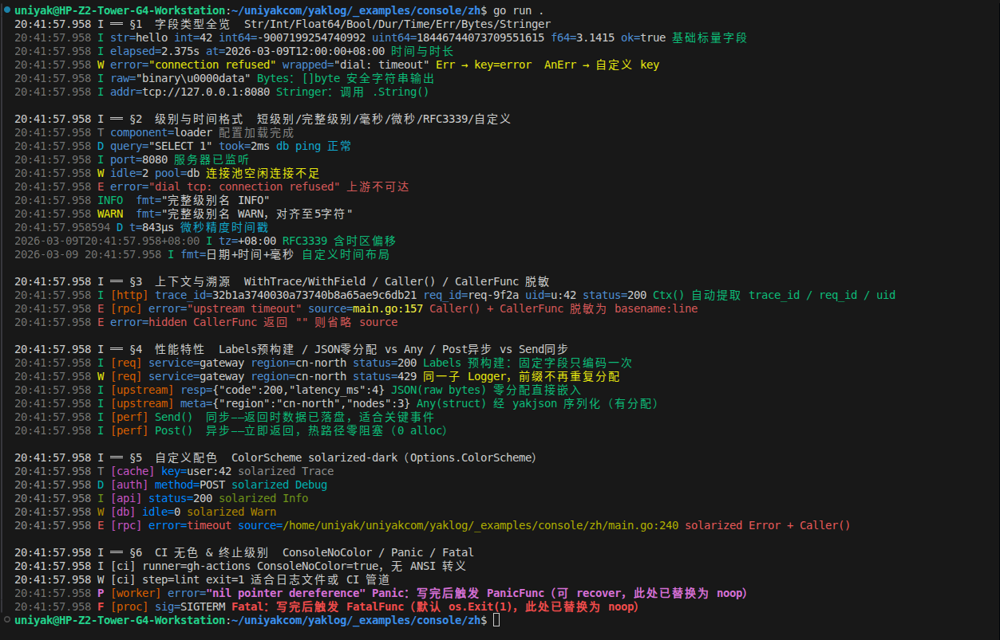

# yaklog

[](https://github.com/uniyakcom/yaklog/blob/main/go.mod)
[](https://pkg.go.dev/github.com/uniyakcom/yaklog)
[](https://goreportcard.com/report/github.com/uniyakcom/yaklog)
[](https://opensource.org/licenses/MIT)
[](https://github.com/uniyakcom/yaklog/actions/workflows/format.yml)
[](https://github.com/uniyakcom/yaklog/actions/workflows/test.yml)
[](https://github.com/uniyakcom/yaklog/actions/workflows/fuzz.yml)

[English](README.md) | **中文**

Go语言高性能JSON日志库

- **零分配热路径**：借助 `bufpool` 预分配缓冲区 + `sync.Pool`，正常日志路径堆分配为零
- **同步 / 异步双路径**：`Send()` 在调用方 goroutine 内同步写入；`Post()` 通过全局包级 worker 异步批量写入
- **链式 API**：`Logger` + `Event` 两层链式调用，无反射，类型安全
- **JSON / Text 双格式**：目标为 `Console` 时自动切换可读文本格式，其余默认 JSON
- **可插拔采样器**：`RateSampler`（令牌桶）/ `HashSampler`（确定性 hash 采样）
- **`adapter` 子包**：将 `*Logger` 适配为 `slog.Handler`，接管标准 `slog.Default()` 及 `stdlib log`
- **热路径安全**：库内部不使用 `panic` 进行错误处理，写入失败只计数

---

## 安装

```bash
go get github.com/uniyakcom/yaklog
```

> **要求**：Go 1.25+。

---

## 快速开始

```go
import "github.com/uniyakcom/yaklog"

func main() {
    // 创建使用默认配置的 Logger（输出到 os.Stderr，级别 Info，JSON 格式）
    l := yaklog.New()
    l.Info().Str("app", "demo").Msg("服务启动").Send()

    // 自定义 Logger
    logger := yaklog.New(yaklog.Options{
        Level: yaklog.Debug,
        Out:   yaklog.Console(),   // Text 格式输出到 os.Stderr
    })
    logger.Debug().Str("env", "dev").Send()

    // 程序退出前等待所有异步日志写入完成
    yaklog.Wait()
}
```

---

## 全局配置

`yaklog.Config` 设置包级默认参数，并（惰性）初始化全局 worker goroutine：

```go
yaklog.Config(yaklog.Options{
    Level:         yaklog.Info,
    Out:           yaklog.Save("./logs/app.log"),
    FileMaxSize:   128,          // MB，超出后轮转
    FileMaxAge:    7,            // 天
    FileMaxBackups: 5,
    FileCompress:  true,
    QueueLen:      8192,
    FlushInterval: 50 * time.Millisecond,
})
```

`Config` 可多次调用，但 `QueueLen` 和 `FlushInterval` 仅**首次调用**（或首次 `New()`）时生效（内部 worker 由 `sync.Once` 只启动一次）；其余字段（`Level`、`Out`、`Source` 等）每次调用均生效，影响之后所有零参 `New()` 创建的 Logger。建议在 `main` 函数最开始调用一次完成初始化。

---

## Options 字段说明

| 字段 | 类型 | 默认值 | 说明 |
|------|------|--------|------|
| `Level` | `Level` | `Info` | 最低输出级别 |
| `Out` | `io.Writer` | `os.Stderr` | 输出目标（`Console()` / `Save(...)` / `Discard()` / 任意 `io.Writer`） |
| `Source` | `bool` | `false` | 是否在每条日志中附加调用文件名和行号 |
| `CallerFunc` | `func(file string, line int) string` | `nil` | 自定义 `source` 字段的显示值；接收原始 file 路径和行号，返回最终写入日志的字符串。返回空字符串则完全省略该字段。常用于只保留文件名（`path.Base(file)`）、路径脱敏、相对路径截取等场景。`Source` 为 `false` 时忽略。 |
| `TimeFormat` | `TimeFormat` | `TimeRFC3339Milli` | 时间格式（见下节） |
| `Sampler` | `Sampler` | `nil`（全量） | 可插拔采样器 |
| `QueueLen` | `int` | `4096` | 异步队列深度（仅 `Post()` 使用） |
| `FlushInterval` | `time.Duration` | `100ms` | worker 定时刷写间隔 |
| `FilePath` | `string` | `""` | 日志文件路径；`Out` 为 nil 时自动调用 `Save(FilePath)`。支持绝对路径或相对路径——相对路径在配置时刻通过进程工作目录解析为绝对路径，即使后续调用 `os.Chdir` 也不会漂移。空字符串回退到 `os.Stderr`。 |
| `FileMaxSize` | `int` | `100`（MB） | 单文件最大体积 MB |
| `FileMaxAge` | `int` | `0`（不限） | 备份文件保留天数；0 = 不过期 |
| `FileMaxBackups` | `int` | `0`（不限） | 最多保留旧文件数；0 = 不限 |
| `FileCompress` | `bool` | `false` | 归档是否 gzip 压缩 |
| `FileLocalTime` | `bool` | `false` | 轮转文件名使用本地时间（否则 UTC） |
| `ConsoleTimeFormat` | `string` | `"15:04:05.000"` | Console 文本格式的时间字符串（`time.Format` 布局） |
| `ConsoleNoColor` | `bool` | `false` | `true` = 关闭 ANSI 颜色输出 |
| `ConsoleLevelFull` | `bool` | `false` | `true` = 完整级别名（`INFO`/`WARN`…）；默认单字母（`I`/`W`…） |
| `ColorScheme` | `ColorScheme` | 零值 | 自定义 ANSI 配色方案；零值字段使用内置默认色；`ConsoleNoColor: true` 时忽略 |

> **Console 视觉方案**
>
> | 元素 | 颜色 | 说明 |
> |------|------|------|
> | 时间戳 | 暗淡灰（`\x1b[2m`） | 低视觉权重，退入背景 |
> | 级别字母/名称 | 各级别专色（见上表） | 最高视觉优先级 |
> | 标签 `[name]` | 橙色（`\x1b[38;5;166m`，256色） | 紧跟级别标识；通过 `logger.Tag("name")` 设置；未设置时不输出 |
> | 字段 `key=` | 暗蓝色（`\x1b[34m`） | 含 `=` 号；静默色调，不与任何级别色冲突 |
> | 字段 value | 默认色（白色） | 与暗 key 形成对比，突出数据 |
> | `Err()` value | 跟随当前日志级别色 | Error→红，Warn→黄，以此类推 |
>
> **间距规则**：单字母级别后 1 空格；完整级别名统一补齐至 5 字符（如 `INFO `）再加 1 空格；字段间 1 空格；消息前 1 空格。
> 设置 `ConsoleNoColor: true` 可完全关闭颜色。



---

## ColorScheme

为每个 Logger 单独定制 ANSI 颜色。在 `Options.ColorScheme` 中传入 `ColorScheme` 值；零值字段自动回退到内置默认色。

```go
type ColorScheme struct {
    Trace  string // 默认: "\x1b[90m"  （暗灰）
    Debug  string // 默认: "\x1b[36m"  （青色）
    Info   string // 默认: "\x1b[32m"  （绿色）
    Warn   string // 默认: "\x1b[33m"  （黄色）
    Error  string // 默认: "\x1b[31m"  （红色）
    Panic  string // 默认: "\x1b[1;35m" （粗体洋红）
    Fatal  string // 默认: "\x1b[1;31m" （粗体红）
    Time   string // 默认: "\x1b[2m"   （暗淡）
    Key    string // 默认: "\x1b[34m"  （蓝色）
    Tag    string // 默认: "\x1b[38;5;166m"  （橙色 256色）
    Source string // 默认: "\x1b[93m"  （亮黄）
}
```

**Solarized-dark 配色示例：**

```go
logger := yaklog.New(yaklog.Options{
    Out:   yaklog.Console(os.Stdout),
    Level: yaklog.Trace,
    ColorScheme: yaklog.ColorScheme{
        Trace:  "\x1b[38;5;244m",
        Debug:  "\x1b[38;5;37m",
        Info:   "\x1b[38;5;64m",
        Warn:   "\x1b[38;5;136m",
        Error:  "\x1b[38;5;160m",
        Panic:  "\x1b[38;5;125m",
        Fatal:  "\x1b[1;38;5;160m",
        Time:   "\x1b[38;5;240m",
        Key:    "\x1b[38;5;33m",
        Tag:    "\x1b[38;5;166m",
        Source: "\x1b[38;5;142m",
    },
})
```

> `ColorScheme` 在 `ConsoleNoColor: true` 或 JSON 输出（`Save`/`File*`）时不生效。

---

## 时间格式

```go
const (
    TimeRFC3339Milli TimeFormat = iota // "2006-01-02T15:04:05.000Z07:00"（默认）
    TimeUnixSec                        // Unix 秒整数
    TimeUnixMilli                      // Unix 毫秒整数
    TimeUnixNano                       // Unix 纳秒整数
    TimeOff                            // 不输出时间字段
)
```

---

## 日志级别

```go
const (
    Trace Level = -2  // 最低追踪级别
    Debug Level = -1
    Info  Level =  0  // 零值，默认最低输出级别
    Warn  Level =  1
    Error Level =  2
    Panic Level =  3  // 写入日志后调用 PanicFunc（默认为内置 panic），可被 defer/recover 捕获
    Fatal Level =  4  // 写入日志后调用 FatalFunc（默认为 os.Exit(1)），不可恢复
)
```

| 级别 | 值 | 行为 |
|------|----|------|
| `Trace` | −2 | 普通输出 |
| `Debug` | −1 | 普通输出 |
| `Info` | 0 | 普通输出（默认最低级别） |
| `Warn` | 1 | 普通输出 |
| `Error` | 2 | 普通输出 |
| `Panic` | 3 | 同步写入日志后执行 `PanicFunc`（默认为内置 `panic`）；可被 `defer/recover` 捕获 |
| `Fatal` | 4 | 同步写入日志 + 等待队列排空，然后调用 `FatalFunc`（默认为 `os.Exit(1)`） |

---

## FatalFunc 与 PanicFunc 钩子

yaklog 将 `Fatal` 退出动作和 `Panic` 动作抽象为可替换函数，常用于测试中捕获这两种行为。

### 钩子函数一览

| 钩子 | 默认行为 | 设置方式 |
|------|---------|----------|
| `FatalFunc` | `os.Exit(1)` | `yaklog.SetFatalFunc(fn)` |
| `PanicFunc` | `panic(msg)` | `yaklog.SetPanicFunc(fn)` |

### 场景一：测试中捕获 Fatal（不真正退出进程）

> 注意：测试中需使用 `Send()` 而非 `Post()`；原因见下方注意事项第 1 条。

```go
func TestFatalLogsAndExits(t *testing.T) {
    var exitCode int
    var exitCalled bool

    // 保存并还原
    old := yaklog.GetFatalFunc()
    defer yaklog.SetFatalFunc(old)
    yaklog.SetFatalFunc(func(code int) {
        exitCode = code
        exitCalled = true
        // 不调用 os.Exit：防止测试进程退出
    })

    var buf bytes.Buffer
    l := yaklog.New(yaklog.Options{Out: &buf, Level: yaklog.Info})
    l.Fatal().Str("reason", "disk full").Msg("服务崩溃").Send()

    if !exitCalled {
        t.Fatal("期望 Fatal 调用 FatalFunc")
    }
    if exitCode != 1 {
        t.Errorf("期望退出码 1，实际 %d", exitCode)
    }
    m := decodeJSON(t, strings.TrimSpace(buf.String()))
    if m["level"] != "FATAL" || m["msg"] != "服务崩溃" {
        t.Errorf("日志内容不匹配: %v", m)
    }
}
```

### 场景二：测试中捕获 Panic（不真正 panic）

```go
func TestPanicLogsAndPanics(t *testing.T) {
    var panicMsg string

    old := yaklog.GetPanicFunc()
    defer yaklog.SetPanicFunc(old)
    yaklog.SetPanicFunc(func(msg string) {
        panicMsg = msg
        // 不调用 panic：测试路径下静默捕获
    })

    var buf bytes.Buffer
    l := yaklog.New(yaklog.Options{Out: &buf, Level: yaklog.Info})
    l.Panic().Str("op", "write").Msg("指针为空").Send()

    if panicMsg != "指针为空" {
        t.Errorf("期望 panic 消息 '指针为空'，实际 %q", panicMsg)
    }
    // 日志必须在 PanicFunc 前已写入
    if !strings.Contains(buf.String(), "PANIC") {
        t.Error("日志未写入")
    }
}
```

### 场景三：生产环境自定义退出清理

```go
func main() {
    // 准备监控客户端
    metrics := initMetrics()

    // 替换 FatalFunc：先上报指标再退出
    yaklog.SetFatalFunc(func(code int) {
        // Fatal 崩溃时先将计数上报监控平台
        metrics.Flush()
        os.Exit(code)
    })

    // ... 业务代码 ...
}
```

> **注意事项**
>
> 1. **`Post()` + `Fatal` 的队列排空只发生在 FatalFunc = `os.Exit` 时**：设置了自定义 FatalFunc 后，`Fatal.Post()` 不等待队列排空。若需在自定义退出前确保所有异步日志落盘，请先调用 `yaklog.Wait()`，再触发 Fatal。
> 2. **`Fatal` 级日志建议用 `Send()`**：保证日志内容在 `FatalFunc` 被调用前已同步写入。
> 3. **`PanicFunc` 期望不返回**：生产环境下，自定义 `PanicFunc` 应调用内置 `panic(msg)` 或 `runtime.Goexit()`；如果函数正常返回，后续代码会继续执行而非崩溃。

---

## 输出目标

> **文件安全检测** — 当目标路径已存在时，`Save` / `FilePath` 在打开文件前会执行三项检测：
> 1. 必须是普通文件（非目录、设备、socket 等），否则返回 `ErrNotLogFile`。
> 2. 不得带有任何可执行权限位（`mode & 0111`），否则返回 `ErrNotLogFile`。
> 3. 前 4 字节不得匹配已知二进制 magic（ELF `\x7fELF`、Mach-O、PE `MZ`），否则返回 `ErrNotLogFile`。
>
> 这些检测可防止因误配置将日志写入可执行文件或二进制文件，从而静默损坏它们。

```go
// Text 格式，输出到 os.Stderr（无参数 = os.Stderr）
out := yaklog.Console()

// Text 格式，输出到自定义 io.Writer
out := yaklog.Console(myWriter)

// 多目标输出：搭配 io.MultiWriter
out := yaklog.Console(io.MultiWriter(os.Stderr, myFile))

// 带轮转的文件；支持绝对路径或相对路径。
// 相对路径在调用时刻通过进程工作目录解析为绝对路径。
out := yaklog.Save("./logs/app.log")

// 丢弃所有输出（测试/性能基准场景）
out := yaklog.Discard()
```

---

## Logger 链式修改

所有修改方法均返回新的 `*Logger`，原 Logger 不受影响。

### Label — 附加固定字段

```go
reqLog := logger.Label("service", "api").Label("version", 2)
reqLog.Info().Msg("收到请求").Send()
// 输出：{"level":"INFO","service":"api","version":2,"msg":"收到请求"}
```

`Label` 支持 `string / int / int64 / uint64 / float64 / bool / any` 类型值。

### Tag — 组件标签

```go
// 附加组件标签；Console 模式在级别标识后渲染为 [name]
cacheLog := logger.Tag("cache")
cacheLog.Info().Str("op", "lookup").Msg("缓存命中").Send()
// Console: 10:30:00.123 I [cache] op=lookup 缓存命中
// JSON:    {"level":"INFO","tag":"cache","op":"lookup","msg":"缓存命中"}
```

`Tag` 返回新的 `*Logger`（与父 Logger 共享 level 和等待组）。Console 模式下标签以橙色（`\x1b[38;5;166m`，256色）渲染在级别标识正后方；JSON 模式下在 `level` 字段之后紧跟输出 `"tag":"name"` 字段。传入空字符串可清除标签。

### Fork — 独立级别和等待组

```go
// 派生出独立级别控制的子 Logger（不影响父 Logger 的级别）
auditLog := logger.Fork()
auditLog.SetLevel(yaklog.Warn)
```

### Context — 绑定 context

```go
// 后续所有事件自动读取 ctx 中的 trace_id
l := logger.Context(ctx)
```

### To — 切换写入目标

```go
// 同一 Logger 逻辑，输出重定向到另一个 io.Writer
fileLog := logger.To(yaklog.Save("./debug.log"))
```

> `To(nil)` 会静默丢弃所有写入，并通过 `OnWriteError` 回调上报 `ErrWriterClosed`。

### SetLevel / GetLevel

```go
logger.SetLevel(yaklog.Debug)
current := logger.GetLevel()
```

### Wait — 等待 Logger 级异步写入

`logger.Wait()` 仅等待该 Logger（及共享等待组的 `Label` 派生子 Logger）的所有 `Post()` 任务写入完成。与 `yaklog.Wait()`（包级全局等待）不同，它不影响其他 Logger 实例。

```go
// 仅等待此 Logger（及其 Label 子 Logger）的 Post() 任务
logger.Wait()
```

> 若通过 `Fork()` 创建了独立子 Logger，需分别对其调用 `Wait()`。

---

## Event 构建链

每个日志级别方法返回 `*Event`；`Msg()` 设置消息体并返回同一 `*Event`；最终调用 `Send()` 或 `Post()` 终结。

```go
l.Info().
    Str("method", "GET").
    Str("path", "/api/users").
    Int("status", 200).
    Dur("latency", 3*time.Millisecond).
    Msg("HTTP 请求完成").
    Send()
```

> **重要**：`Msg()` 不是终结符，必须跟 `Send()` 或 `Post()` 才能触发写入。

### 支持的字段方法

| 方法 | 输出示例 |
|------|---------|
| `Str(key, val string)` | `"key":"val"` |
| `Int(key string, val int)` | `"key":42` |
| `Int64(key string, val int64)` | `"key":-1` |
| `Uint64(key string, val uint64)` | `"key":18446...` |
| `Float64(key string, val float64)` | `"key":3.14` |
| `Bool(key string, val bool)` | `"key":true` |
| `Time(key string, val time.Time)` | `"key":"2026-01-02T..."` |
| `Dur(key string, val time.Duration)` | `"key":"3m7s"` |
| `Err(err error)` | `"error":"..."`（nil 时跳过） |
| `AnErr(key string, err error)` | `"key":"..."` （nil 时跳过） |
| `Bytes(key string, val []byte)` | `"key":"..."` （zero-copy） |
| `Any(key string, val any)` | `"key":<JSON>` （经 yakjson 序列化） |
| `JSON(key string, raw []byte)` | `"key":<raw>` （原始 bytes 直接嵌入，零分配，不经过 reflect） |
| `Stringer(key string, val fmt.Stringer)` | `"key":"..."` |
| `Ctx(ctx context.Context)` | 覆盖 Logger 绑定的 ctx（用于 trace_id 提取） |
| `Caller()` | 附加 `source=file:line`；per-event 按需定位，无需全局开启 `Source: true` |
| `Msg(msg string)` | 设置消息体，**返回 *Event**，非终结符 |

### Send 与 Post

```go
// Send：在调用方 goroutine 内同步写入，返回后数据已落盘
e.Send()

// Post：投入全局 worker 队列异步写入，立即返回
// 如果队列满则丢弃（计入 Dropped() 计数），不阻塞
e.Post()
```

---

## 同步 / 异步等待

### 为什么必须调用 Wait()

`Post()` 将日志缓冲投入包级 worker 队列后**立即返回**。若进程在 worker 写入完成前退出，队列中尚未写入的日志将**静默丢失**，不会有任何警告。

**没有调用 `Wait()` 就退出的后果**（`Post()` 路径）：

- 队列中剩余的日志永久丢失
- 包括 `Error`、`Warn` 等关键级别日志
- 在压力测试或批处理场景中尤其明显

**推荐模式**：

```go
func main() {
    yaklog.Config(yaklog.Options{...})
    defer yaklog.Wait() // 确保进程退出前所有 Post 日志落盘

    // ... 业务代码 ...
    l.Info().Msg("服务启动").Post()
}
```

```go
// 包级 Wait：等待所有通过 Post() 提交的异步任务写入完成
// 覆盖所有 Logger 实例的 Post 任务
yaklog.Wait()

// Logger 级 Wait：仅等待此 Logger 实例（及 Label 子 Logger）的 Post() 任务
// Fork() 派生的子 Logger 有独立等待组，需单独等待
logger.Wait()

// 查看因队列满而丢弃的 Post 任务总数（用于监控）
dropped := yaklog.Dropped()

// 查看写入失败总次数（Send + Post 路径，I/O 错误计数）
errs := yaklog.ErrCount()
```

> **Send() 路径无需 Wait()**：`Send()` 在调用方 goroutine 内同步完成写入，返回后数据已落盘，不进入队列。

> **Wait() 期间并发 Post() 的行为**：与 `Wait()` 并发执行的 `Post()` 调用不保证被本次 `Wait()` 覆盖。调用 `Wait()` 前应确保所有生产方已停止提交；违反此约定不会崩溃或损坏数据，但部分日志可能未落盘。

### Wait 与 Shutdown 对比

| | `Wait()` | `Shutdown()` |
|---|---|---|
| 排空队列 | ✅ | ✅ |
| 调用后是否继续接受 `Post()` | ✅ | ❌（返回 `ErrWriterClosed`）|
| 适用场景 | 程序中途检查点、Logger 级同步 | 进程退出、最终清理 |
| 可逆 | ✅ | ❌ |

典型用法：正常运行期间使用 `defer yaklog.Wait()`；仅在不再需要异步写入时（如优雅停机钩子）才调用 `yaklog.Shutdown()`。

---

## 上下文注入

### TraceID

```go
import "github.com/uniyakcom/yaklog"

// 将 [16]byte TraceID 注入 context
var traceID [16]byte
copy(traceID[:], someTraceBytes)
ctx = yaklog.WithTrace(ctx, traceID)

// Logger 绑定 ctx 后，每条日志自动追加 "trace_id":"<32位hex>"
l := logger.Context(ctx)
l.Info().Msg("处理请求").Send()
// 输出：{"level":"INFO","trace_id":"0102...1f20","msg":"处理请求"}
```

### 附加任意字段到 context

```go
ctx = yaklog.WithField(ctx, "request_id", "req-abc-123")
```

### Logger 存储于 context

```go
// 将 Logger 存入 ctx，跨调用链传递
ctx = yaklog.WithLogger(ctx, logger)

// 从 ctx 取回 Logger（未设置时返回全局默认 Logger）
l := yaklog.FromCtx(ctx)
l.Info().Msg("从 ctx 取到的 Logger").Send()
```

### EventSink

```go
// 在 ctx 中注册事件监听器（用于测试、指标采集等）
type mySink struct{}
func (s *mySink) Emit(level yaklog.Level, msg string, raw []byte) {
    // raw 是完整的 JSON / Text 编码字节
}
ctx = yaklog.WithEventSink(ctx, &mySink{})
```

---

## 采样器

### RateSampler（令牌桶）

```go
// 每秒最多 100 条，允许 10 条突发
sampler := yaklog.NewRateSampler(100, 10)
l := yaklog.New(yaklog.Options{Sampler: sampler})
```

### HashSampler（确定性 hash 采样）

```go
// 固定采样 30%（相同 level+msg 组合结果稳定）。
// 注意：当作为 Logger.Sampler 使用时，采样在 Msg() 调用之前执行，
// 因此 msg 始终为 ""，实际上采样仅基于 level 生效。
// 若需按消息内容采样，请在业务代码中直接调用 sampler.Sample()。
sampler := yaklog.NewHashSampler(0.3)
l := yaklog.New(yaklog.Options{Sampler: sampler})

// 运行时热更新所有级别的采样率——原子写入，对所有 goroutine 立即可见。
sampler.SetRate(0.1) // 全部级别改为 10%，无需重建 Logger

// 每级别独立限额：例如 Error/Warn 全量输出，Debug 仅输出 5%。
sampler.SetRateForLevel(yaklog.Error, 1.0)
sampler.SetRateForLevel(yaklog.Warn,  1.0)
sampler.SetRateForLevel(yaklog.Info,  0.2)
sampler.SetRateForLevel(yaklog.Debug, 0.05)
```

`SetRateForLevel` 让每个日志级别拥有独立的采样阈值——适合高吸吐服务需要错误全量保留、而调试输出尺度进行采样的场景。级别到插槽映射确定为 `uint8(level) & 7`。

自定义采样器实现 `Sampler` 接口：

```go
type Sampler interface {
    Sample(level Level, msg string) bool
}
```

---

## adapter 子包

### 接管 slog.Default()

```go
import "github.com/uniyakcom/yaklog/adapter"

l := yaklog.New(yaklog.Options{Level: yaklog.Info})
adapter.SetDefault(l)

// 之后所有 slog.Info / slog.Warn / slog.Error 均路由至 l
slog.Info("via slog", "key", "val")
```

运行时调用 `l.SetLevel(yaklog.Debug)` 更改级别后，需调用 `adapter.RefreshDefault()` 在不重建处理器的前提下，使默认 `slog.Logger` 的 `Enabled` 检查感知新级别：

```go
l.SetLevel(yaklog.Debug)
adapter.RefreshDefault() // slog.Debug(...) 现在可以通过 Enabled 居
```

### 接管 stdlib log

```go
import (
    "log"
    "log/slog"
    "github.com/uniyakcom/yaklog/adapter"
)

l := yaklog.New(yaklog.Options{Level: yaklog.Info})
log.SetOutput(adapter.ToStdLogWriter(l, slog.LevelWarn))
log.Print("legacy log message") // 以 Warn 级别路由至 l
```

**属性处理说明：**
- `slog.KindLogValuer` 属性在编码前展开，避免自引用 valuer 导致无限循环风险。
- `slog.Group` 属性展平为 `"组.key"` 字段（最多 16 层）。示例：`slog.Group("http", slog.String("method", "GET"))` → 字段 `http.method`。
- `WithGroup(name)` 已完整符合 slog 规范：从 `WithGroup("req")` 派生的 handler 所输出的字段均携带前缀 `req.`（例如 `slog.String("id", "x")` → `"req.id":"x"`）。嵌套分组会叠加前缀：`WithGroup("a").WithGroup("b")` 后的所有字段均以 `a.b.` 为前缀。传入空字符串为无操作。

---

## 轮转子包

轮转功能由 `rotation` 子包实现，通过 `Save()` 或 `Options.FilePath` 自动启用：

```go
yaklog.Config(yaklog.Options{
    Out:            yaklog.Save("./logs/app.log"),
    FileMaxSize:    64,    // 超过 64 MB 后轮转
    FileMaxAge:     30,    // 保留 30 天
    FileMaxBackups: 10,    // 最多 10 个归档
    FileCompress:   true,  // gzip 压缩旧文件
    FileLocalTime:  false, // 文件名使用 UTC 时间
})
```

如需直接使用 `rotation`（例如防御磁盘空间不足），可用 `rotation.New` 构建 `RotatingWriter`：

```go
import "github.com/uniyakcom/yaklog/rotation"

w, err := rotation.New(
    rotation.WithDir("/var/log/app"),
    rotation.WithFilename("app"),
    rotation.WithMaxSize(64 << 20),       // 64 MiB
    rotation.WithMinFreeBytes(200 << 20), // 可用空间低于 200 MiB 时拒绝打开
)
if err != nil {
    log.Fatal(err)
}
yaklog.Config(yaklog.Options{Out: w})
```

当可用磁盘空间低于阈值时，`rotation.New` 和 `RotatingWriter.Rotate` 返回 `rotation.ErrInsufficientDiskSpace`。
结合 `yaklog.SetOnWriteError` 可实现磁盘告警：

```go
yaklog.SetOnWriteError(func(err error) {
    if errors.Is(err, rotation.ErrInsufficientDiskSpace) {
        metrics.IncrCounter("log.disk_full", 1)
    }
})
```

> 非 Unix 平台（如 Windows）上磁盘空间检查会被跳过，`WithMinFreeBytes` 不产生任何效果。

`RotatingWriter.Close` 具幂等性，多次调用安全，第二次起始终返回 `nil`。

当 `Write` 写入单条消息的字节数 ≥ `maxSize` 且当前文件已有内容时，写入器会先轮转当前文件，再将该超大消息写入全新文件，避免大消息被拆分到两个备份归档中。

当底层文件写入失败时（如磁盘已满），`RotatingWriter` 会调用 `WithOnWriteError` 设置的回调函数。无回调时自动回退写入 `os.Stderr`，确保日志不丢失：

```go
w, _ := rotation.New(
    rotation.WithDir("/var/log/app"),
    rotation.WithFilename("app"),
    rotation.WithOnWriteError(func(err error, p []byte) {
        // err：底层 I/O 错误
        // p：未能写入的日志数据
        metrics.IncrCounter("log.write_errors", 1)
        _, _ = os.Stderr.Write(p) // 手动回退
    }),
)
```

### 备份总大小限制

使用 `WithMaxTotalSize` 设置所有备份文件的总大小上限（字节）。每次轮转清理后，若剂原备份体积之和超出阈值，则从最旧的文件开始删除直至达标。
`WithMaxTotalSize` 可与 `WithMaxBackups`、`WithMaxAge` 组合使用，最严格的约束生效。

```go
w, _ := rotation.New(
    rotation.WithDir("/var/log/app"),
    rotation.WithFilename("app"),
    rotation.WithMaxSize(64 << 20),       // 单文件 64 MiB
    rotation.WithMaxTotalSize(512 << 20), // 所有备份总上限 512 MiB
)
```

### 健康探针

`RotatingWriter.Healthy()` 报告写入器是否处于正常开放状态且最近一次文件写入成功。并发安全（纯原子读，无锁），适合健康检查和指标采集。

```go
if !w.Healthy() {
    metrics.IncrCounter("log.writer_unhealthy", 1)
}
```

`Healthy()` 返回 `false` 的条件：
- `Close()` 已调用。
- 最近一次 `file.Write` 返回错误（如磁盘满、fd 失效）。

下次 `Write` 调用成功后，`Healthy()` 自动恢复为 `true`。

---

## 性能基准

以下数据在 **无 PGO** 条件下采集，3 次运行取中位数。  
测试方法：所有子测试均使用 `RunParallel` + `io.Discard`，与 zerolog/zap README 数字口径一致。  
yaklog 使用 `Send()`（同步路径）+ `TimeOff`（不输出时间戳），与 zerolog 默认无时间戳行为保持等量编码，确保公平对比。

**测试环境**

| 项目 | 值 |
|------|----|
| CPU | Intel Xeon E-2186G @ 3.80GHz（6C/12T） |
| OS | Linux amd64 |
| Go | 1.26（GOMAXPROCS=12） |
| PGO | 未使用 |
| 输出目标 | `io.Discard` |

### 静态消息（无字段）

| 库 | ns/op | B/op | allocs/op |
|----|------:|-----:|----------:|
| **yaklog** | **13.7** | 0 | 0 |
| zerolog | 17.4 | 0 | 0 |
| zap | 46.9 | 0 | 0 |
| zap (sugared) | 48.2 | 0 | 0 |
| slog（JSON）| 134 | 0 | 0 |
| logrus | 3 217 | 1 585 | 28 |

### 消息 + 10 字段

| 库 | ns/op | B/op | allocs/op |
|----|------:|-----:|----------:|
| **yaklog** | **66.3** | 0 | 0 |
| zerolog | 69.8 | 0 | 0 |
| zap | 463 | 731 | 2 |
| zap (sugared) | 619 | 1 438 | 2 |
| slog（JSON）| 469 | 225 | 3 |
| logrus | 11 391 | 4 745 | 68 |

### 10 字段预构建 Logger（上下文复用）

| 库 | ns/op | B/op | allocs/op |
|----|------:|-----:|----------:|
| **yaklog** | **14.1** | 0 | 0 |
| zerolog | 18.1 | 0 | 0 |
| zap | 47.9 | 0 | 0 |
| zap (sugared) | 50.4 | 0 | 0 |
| slog（JSON）| 142 | 0 | 0 |
| logrus | 9 565 | 3 291 | 59 |


> 完整多库对比基准源码及可复现结果：[`_benchmarks/run.sh`](_benchmarks/run.sh)。

---

## 性能建议

1. **优先使用 `Post()`** — 异步路径批量写入，热路径零分配；仅在需要确保写入完成时用 `Send()`。
2. **避免 `Any()` 在热路径** — `Any()` 需调用 yakjson 序列化，可能产生少量分配；对已知类型请用 `Str / Int / Bool` 等专用方法。如果已有序列化好的 JSON bytes，请改用 `JSON(key, raw)` ——直接嵌入原始 bytes，零分配。
3. **主函数末尾调用 `yaklog.Wait()`** — 确保程序退出前所有异步日志落盘。
4. **合理设置 `QueueLen`** — 默认 4096；流量峰值高时可调大至 16384+，避免丢弃。
5. **`Label` 链预构建** — 在初始化阶段完成 `Label` 链，运行时复用，避免重复分配前缀缓冲。

```go
// ✅ 推荐：启动时构建固定字段的子 Logger
reqLog := logger.Label("service", "api").Label("region", "cn-east")

// 请求处理中复用
reqLog.Info().Str("path", r.URL.Path).Msg("请求").Post()
```


---

## 开发工具

### lint.sh — 代码质量检查

```bash
bash lint.sh              # 完整检查：gofmt -s + go vet + golangci-lint
bash lint.sh --vet        # 仅 gofmt + go vet（跳过 golangci-lint）
bash lint.sh --fix        # golangci-lint --fix 自动修复
bash lint.sh --fmt        # 仅格式化（gofmt -s -w），不运行检查
bash lint.sh --test       # 快速测试（go test ./... -race -count=1）
```

> `golangci-lint` 如未安装，脚本会自动从官方安装脚本安装到 `$GOPATH/bin`。

### bench.sh — 基准测试（yaklog 内部）

```bash
bash bench.sh             # 默认：benchtime=3s，count=3
bash bench.sh 5s 5        # 自定义：benchtime=5s，count=5
```

输出保存到 `bench_<os>_<cores>c<threads>t.txt`，包含 CPU / Go 版本 / 内核信息头部。

### _benchmarks/run.sh — 多库横向对比

```bash
cd _benchmarks
./run.sh                        # 全部基准（3s × 3 次），保存 results_*.txt
BENCHTIME=5s COUNT=5 ./run.sh   # 自定义参数
```

结果保存到 `_benchmarks/results_<os>_<cores>c<threads>t_<时间戳>.txt`，  
作为本 README 及双语文档中基准数据表格的**规范数据源**。

### fuzz.sh — 模糊测试

```bash
bash fuzz.sh                        # 所有 Fuzz 目标，各跑 5m
bash fuzz.sh 2m                     # 所有目标，自定义时长 2m
bash fuzz.sh FuzzJSONEncoder        # 单目标 5m
bash fuzz.sh FuzzJSONEncoder 2m     # 单目标 2m
FUZZ_TIME=10m bash fuzz.sh         # 环境变量指定时长
```

崩溃记录自动保存到 `fuzz_logs/fuzz_<时间戳>.log`。按 Ctrl+C 跳到下一个目标，再按一次退出。

---

## 许可证

[MIT](LICENSE) © 2026 uniyak.com
